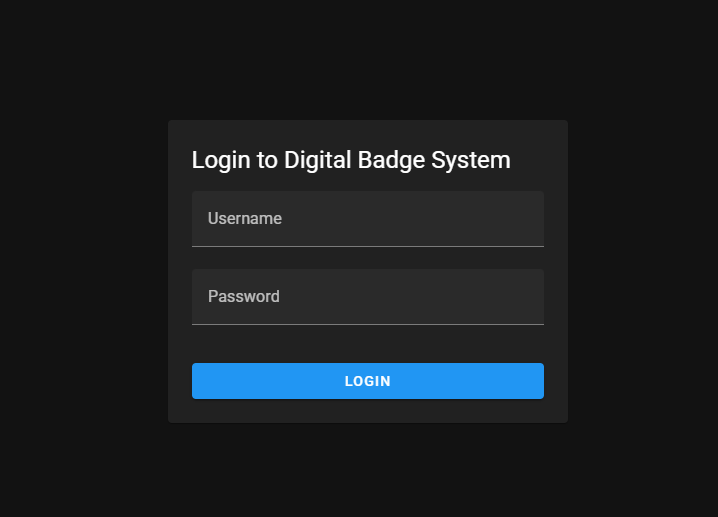
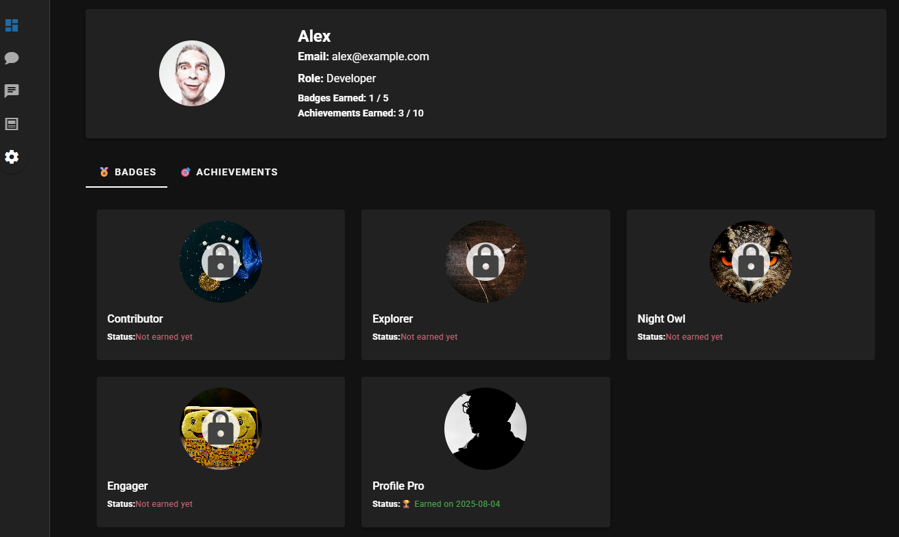
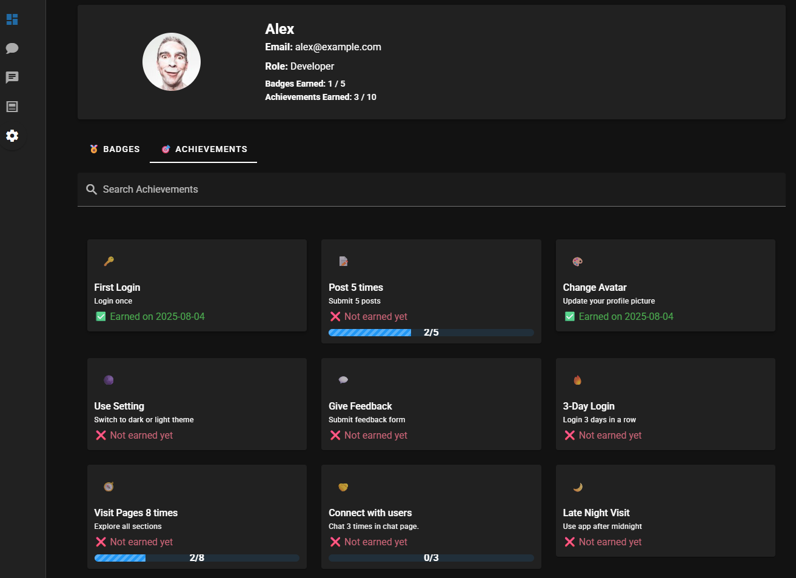

# Digital Badge System

A simple web app using FastAPI and Vue + Vuetify for tracking and awarding achievements.

---

## 🛠️ Setup and Run Instructions

### Backend (FastAPI)

1. Create a virtual environment:
    ```bash
    python -m venv venv
    venv\Scripts\activate on Windows  # or source venv/bin/activate
    ```
2. Install requirements:
    ```bash
    pip install -r requirements.txt
    ```
3. Navigate to backend folder and run the backend:
    ```bash
	cd backend
    uvicorn main:app --reload
    ```

### Frontend (Vue + Vuetify)

1. Navigate to the frontend folder:
    ```bash
    cd frontend
    ```
2. Install dependencies:
    ```bash
    npm install
    ```
3. Run the frontend:
    ```bash
    npm run dev
    ```

---

## 📝 Project Overview

- **Backend**: the backend provides a RESTful API to manage user achievements. It uses in-memory mock data to simulate users, achievements, and progress — meaning data is not stored permanently in a database but reset when the server restarts. This approach simplifies development and testing while demonstrating core logic such as:
    - Incrementing progress toward achievements
    - Marking achievements as earned
    - Returning user-specific achievement status
- **Frontend**: Developed using Vue 3 with Vuetify for UI components. The frontend connects to the backend to dynamically fetch and display achievements. Users can navigate between four main pages — Dashboard, Chat, Feedback, and Post — with each visit tracked for achievement progress. A dedicated Achievement page visually displays earned and unearned achievements using icons, progress bars, and celebratory popups when one is unlocked.
- **Store**: Uses **Pinia** for global state management to track earned achievements and trigger pop-up notifications when new ones are unlocked.
- **Logic**: 
  - Earn achievements for:
    - Posting 5 times  
    - Giving feedback  
    - Toggling settings  
    - Visiting various pages (Dashboard, Chat, Post, Feedback)  
    - Engaging with other users (e.g., sending messages)

---

## 📸 Screenshots
### Start Page

### Dashboard Page

### Dashboard Page showing achievements


---

## 🚀 Potential Feature Improvements

- **Persistent Achievement Tracking**: Integrate a real database to store user activity and achievement progress permanently across sessions.
- **AI-Powered Achievement Tips**: Add a real-time chat assistant that suggests achievements for users to pursue based on their behavior.
- **Admin Dashboard**: Implement an admin panel to create, edit, and manage achievements and user progress.
- **Enhanced Visuals**: Introduce animated badges, unlock effects, and sounds to make achievements more rewarding and engaging.


